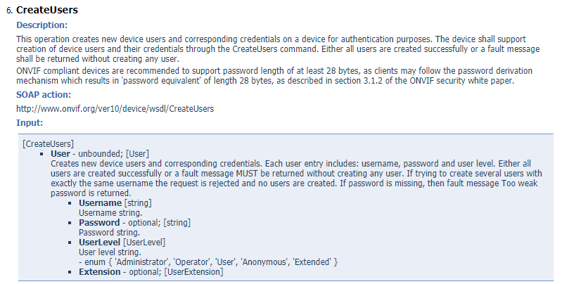

# Goonvif
Библиотека **Goonvif** создана для упрощения взаимодействия с ONVIF устройствами. На данный момент в библиотеке реализована поддержка NVT(Network Video Transmitter) устройств, а именно следующих ONVIF сервисов:
- Core или DeviceManagement
- Media
- Imaging
- PTZ
- Analytics
# Dependencies
[etree](https://github.com/beevik/etree)
# Установка
Для установки библиотеки необходимо воспользоваться утилитой go get:
```
go get github.com/yakovlevdmv/goonvif
```

# Начало работы
Чтобы начать работать с камерой, необходимо создать объект `device`.
Для этого необходимо воспользоваться функцией `func NewDevice(xaddr string) (*device, error)`,
которая принимает IP адрес ONVIF устройства и возвращает указатель на созданный объект либо ошибку.
Если камера недоступна, указан неверный адрес для ONVIF сервиса камеры (возможно находится по другому порту) или же камера вообще не поддерживает ONVIF
функция вернет error не являющимся `nil`, а в качестве указателя на объект устройства вернет `nil`.
### Пример подключения к камере
Пусть камера в сети находится по адресу 192.168.13.42, а ее ONVIF сервисы расположены на порте 1234. Тогда,
```
dev, err := goonvif.NewDevice("192.168.13.42:1234")
```
сработает успешно, а
```
dev, err := goonvif.NewDevice("192.168.13.42:80")
```
вернет нулевой объект камеры и ошибку:
> camera is not available at 192.168.13.42:80 or it does not support ONVIF services

Модернизируем код, добавив обработку ошибки, и получим:
```
dev, err := goonvif.NewDevice("192.168.13.42:80")
if err != nil {
    panic(err)
}

///Работа с камерой
```
### Поддерживаемые ONVIF сервисы
Теперь, когда камера доступна, можно приступать к работе с ней. Однако стандарт ONVIF имеет множество сервисов, а также точку доступа (endpoint) которая не определена стандартом (кроме DeviceManagment: http://onvif_host/onvif/device_service).
Поэтому дальше встает вопрос о поддерживаемых камерой сервисах и определении их endpoint'ов.
Для получения поддерживаемых камерой сервисов необходимо вызвать метод GetCapabilities сервиса DeviceManagement.
Однако эта библиотека автоматизирует данный процесс, поэтому при создании объекта device при помощи `func NewDevice(xaddr string) (*device, error)`
библиотека одновременно обрабатывает поддерживаемые камерой сервисы. Таким образом есть два способа получения поддерживаемых устройством сервисов:
1. Вызвать метод GetCapabilities сервиса DeviceManagement(как это сделать будет рассмотрено дальше) и обработать ответ.
2. Довериться библиотеке и вызвать функцию  `func (dev *device)GetServices() map[string]string`, которая вернет map[string]string, ключом которой является название сервиса, а значением - endpoint данного сервиса
### Работа с камерой
Для работы с различными сервисами камерами необходимо отправить корректный SOAP запрос, в теле которого находится вызываемый метод и принимаемые им функции.
**Goonvif** берет на себя работу по созданию корректного SOAP запроса и его отправке. В **Goonvif** определены структуры, для каждой функции каждого (поддерживаемого данной бибилиотекой) сервиса ONVIF:
- [DeviceManagement Service](Device/types.go)

- [Media Service](Media/types.go)

- [Imaging Service](Imaging/types.go)

- [PTZ Service](PTZ/types.go)

- [Analytics Service](Analytics/types.go)

[Список всех сервисов стандарта (и документация к ним)](https://www.onvif.org/profiles/specifications/)

Рассмторим, как организована отправка запросов в **Goonvif** на нескольких примерах.
1. Метод GetCapabilities сервиса DeviceManagement

Все необходимые типы данных определены в пакете [Device](Device/types.go).
В файле (https://www.onvif.org/ver10/device/wsdl/devicemgmt.wsdl) можно увидеть:


Таким образом, Функция GetCapabilities принимает в качестве аргумента перечисление:
`enum { 'All', 'Analytics', 'Device', 'Events', 'Imaging', 'Media', 'PTZ' }`
Чтобы вызвать данный метод создадим объект `Device.GetCapabilities`:
```
capabilities := Device.GetCapabilities{Category:"All"}
```
Для вызова данной функции воспользуемся методом `func (dev device) CallMethod(method interface{}) (string, error)`:
```
resp, err := dev.CallMethod(capab)
if err != nil {
    log.Println(err)
} else {
    fmt.Println(resp)
}
```
2. Создание пользователя методом CreateUsers сервиса DeviceManagement

Все необходимые типы данных определены в пакете [Device](Device/types.go).
В файле (https://www.onvif.org/ver10/device/wsdl/devicemgmt.wsdl) можно увидеть структуру запроса:


Создадим объект `Device.CreateUsers`:
```
createUsers := Device.CreateUsers{User: onvif.User{Username:"korolev", Password:"qwerty", UserLevel:"User"}}
resp, err := dev.CallMethod(createUsers)
if err != nil {
	log.Println(err)
} else {
	fmt.Println(resp)
}
```

В данном примере можно наблюдать использование пакета onvif, в котором определено большинство типов, используемых в поддерживаемых библиотекой сервисах, поэтому при создании структур запросов необходимо это учитывать.

##### ВАЖНО
Некоторые камеры работают специфично. Это означает, что в зависимости от модели камеры можно не получить ошибки при неправильном запросе. Поэтому советую проверять, точно ли выполнилась операция. Например, для метода CreateUsers надо вывести список всех пользователей и проверить добавился ли пользователь.

3. Метод ContinuousMove сервиса PTZ

Все необходимые типы данных определены в пакете [PTZ](PTZ/types.go).
В файле (https://www.onvif.org/ver20/ptz/wsdl/ptz.wsdl) можно увидеть структуру запроса:


Так как данная команда определяется сервисом PTZ, необходимый тип находится в пакете [PTZ](PTZ/types.go).
Из файла [PTZ](PTZ/types.go) можно заметить, что :
> ProfileToken [ReferenceToken]
> A reference to the **MediaProfile** that indicate what should be stopped.

Таким образом, для того, чтобы начать работать с PTZ сервисом для начала необходимо получить **ProfileToken** сервиса **Media**. Как это сделать смотрите в примере 4. Сейчас же предположим, что нам известен нужный токен. Пусть ProfileToken = "Profile_1".

Создадим объект `PTZ.ContinuousMove`:
```
move := PTZ.ContinuousMove{
	ProfileToken:"Profile_1",
	Velocity:onvif.PTZSpeed{
		PanTilt:onvif.Vector2D{
			X: 1,
			Y: 1,
		},
		Zoom:onvif.Vector1D{X:0.5},
	},
}
```

**Заметим**, что объекты Velocity, PanTilt и Zoom определены в пакете onvif. Такое применение свойственно для большинства встроенных в структуру типов.

Для вызова данной функции воспользуемся методом `func (dev device) CallMethod(method interface{}) (string, error)`:
```
resp, err := dev.CallMethod(capab)
if err != nil {
    log.Println(err)
} else {
    fmt.Println(resp)
}
```

4. Получение списков Media профилей

Все необходимые типы данных определены в пакете [Media](Media/types.go).
В файле (https://www.onvif.org/ver10/media/wsdl/media.wsdl) можно увидеть структуру запроса:


Вот пример создания и вызова запроса GetProfiles
```
resp, err := dev.CallMethod(Media.GetProfiles{})
if err != nil {
	panic (err)
} else {
	fmt.Println(readResponse(resp))
}
```

**Важно** Обработка response'ов камеры пока не реализована, поэтому данная задача ложится на **Ваши** плечи. Вы можете упростить обработку response'ов при помощи библиотеки [etree](https://github.com/beevik/etree) либо же воспользоваться сервисом (http://www.webtoolkitonline.com/xml-formatter.html)

**Важно** Многие запросы требуют авторизованного доступа и для того, чтобы добавить аторизацию к конкретной камере, необходимо воспользоваться функцией `func (dev *device) Authenticate(username, password string)`. После применения данной функции все отправляемые камерой запросы будут авторизованными.
```
device := onvif.NewDevice("192.168.13.42:1234")
device.Authenticate("username", "password")
```
